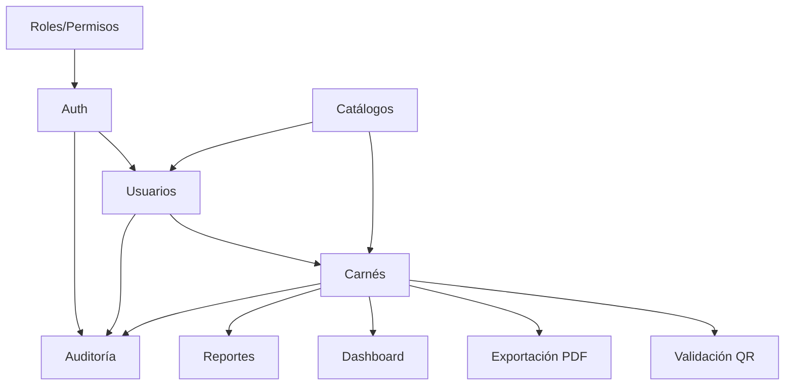

# Arquitectura — SENA Carnés

**Stack activo:** Express + MySQL + HTML/Bootstrap  
**Última actualización:** 2026-06-26 (Sprint 7)

---

## Visión

Sistema monolito **Node.js/Express** que sirve API REST y archivos estáticos desde `public/`. La lógica de negocio vive en servicios que ejecutan SQL parametrizado contra MySQL. La autenticación usa sesiones server-side con cookies HTTP.

> **Nota:** Existe una implementación previa en Next.js/Prisma (`src/`) marcada como legacy. Este documento describe el stack activo. La legacy sirve como referencia para portar funcionalidades.

---

## Diagrama de arquitectura

```
┌──────────────────────────────────────────────────────────────┐
│                     Cliente (Navegador)                       │
│  HTML + Bootstrap 5 + JavaScript vanilla (public/)           │
│  api.js → fetch con credentials: 'include'                   │
└────────────────────────────┬─────────────────────────────────┘
                             │ HTTP
┌────────────────────────────▼─────────────────────────────────┐
│                    Express (backend/app.js)                     │
│  ┌─────────────────────────────────────────────────────────┐   │
│  │ Middleware global                                        │   │
│  │  CORS → Security Headers → Rate Limit → JSON parser   │   │
│  │  → Session → CSRF Token                                │   │
│  └─────────────────────────────────────────────────────────┘   │
│  ┌──────────────┐  ┌──────────────┐  ┌──────────────────────┐  │
│  │ Static files │  │ /api routes  │  │ Page routes          │  │
│  │ public/      │  │ routes/      │  │ pages.routes.js      │  │
│  └──────────────┘  └──────┬───────┘  └──────────────────────┘  │
└───────────────────────────┼────────────────────────────────────┘
                            │
┌───────────────────────────▼────────────────────────────────────┐
│                      Controllers                                │
│  Orquestación HTTP · Respuestas JSON · Llamadas a auditoría    │
│  auth.controller.js · users.controller.js · catalog.controller.js │
│  organizacion.controller.js · roles.controller.js · carnets.controller.js │
│  carnetDocumento.controller.js · validacion.controller.js · dashboard.controller.js │
└───────────────────────────┬────────────────────────────────────┘
                            │
┌───────────────────────────▼────────────────────────────────────┐
│                       Services                                  │
│  Lógica de negocio · Permisos de alcance · Validaciones        │
│  auth.service · users.service · catalog.service · qr · validacion           │
│  carnetPdf · dashboard · auditoria                                          │
└───────────────────────────┬────────────────────────────────────┘
                            │
┌───────────────────────────▼────────────────────────────────────┐
│                    Repositories (Sprint 1+)                     │
│  SQL parametrizado · Sin lógica de negocio                     │
│  users.repository.js · regionales.repository.js · centros.repository.js │
│  dependencias.repository.js · roles.repository.js · permisos.repository.js │
│  carnets.repository.js · carnetDocumentos.repository.js · dashboard.repository.js │
└───────────────────────────┬────────────────────────────────────┘
                            │
┌───────────────────────────▼────────────────────────────────────┐
│                    MySQL 8 (mysql2 pool)                        │
│  database/schema.sql · sena_carnets                            │
└────────────────────────────────────────────────────────────────┘
```

---

## Organización de carpetas

```
backend/
├── server.js
├── app.js
├── config/            # env, database, session, upload
├── constants/         # enums, permisos, límites (Sprint 1)
├── controllers/       # auth, users, catalog, organizacion, roles
├── repositories/      # SQL por entidad
├── routes/            # auth, users, catalog, organizacion, roles, pages
├── services/          # Lógica de negocio
├── middleware/
├── lib/               # email, sanitización, carnetTemplate, pdf
├── templates/carnets/ # Plantillas EJS (Sprint 5)
└── utils/             # request, pagination, permissions, validators, mappers

public/
├── pages/             # Vistas HTML (MPA)
├── js/                # Cliente API por módulo
├── css/
├── templates/
└── uploads/           # Fotos (runtime)
```

---

## Flujo de datos

### Patrón obligatorio

```
Route → Middleware → Controller → Service → Repository → MySQL
```

### Ejemplo: dashboard ejecutivo

```
GET /api/dashboard
  → requireAuth
  → dashboard.controller.index
      → dashboard.service.getDashboard(actor)
          → dashboard.repository (agregaciones paralelas por rol)
  → res.json({ resumen, graficas, alertas, actividad, quickActions })
```

### Ejemplo: descargar PDF de carné

```
GET /api/carnets/:id/documento/pdf
  → requireAuth + requirePermission(carnets.ver|generar)
  → carnetDocumento.controller.downloadPdf
      → carnetPdf.service.getOrCreatePdf (caché por pdf_hash)
      → carnetDocumentos.repository.insert(DESCARGAR)
      → auditoria.log(DESCARGAR)
  → res.sendFile(pdf)
```

### Ejemplo: crear usuario

```
POST /api/usuarios
  → requireAuth + requireRole(ADMIN, COORD)
  → csrfProtection
  → upload.single('foto')
  → validateCreateUser
  → users.controller.create
      → users.service.create (reglas + alcance regional)
      → users.repository.insertUser
      → auditoria.service.log(CREAR)
```

### Ejemplo: login

```
POST /api/auth/login
  → loginRateLimit
  → csrfProtection          ← token vía GET /api/auth/csrf-token + X-CSRF-Token
  → validateLogin
  → auth.controller.login
      → inputSanitizer (email, SQL/XSS detection)
      → auth.service.authenticate
      → req.session.user = sessionData
      → auditoriaService.log(LOGIN)
  → res.json({ success, data })
```

---

## Autenticación y autorización

### Sesión

| Aspecto | Implementación |
|---------|---------------|
| Store | Memoria (express-session default) |
| Cookie | `sena_carnets_sid`, httpOnly |
| Duración | `SESSION_MAX_AGE` (default 8h) |
| Datos en sesión | id, email, nombreCompleto, rolNombre, tipoUsuario, permisos[] |

### Autorización actual

- **Páginas HTML:** `requireAuth` redirige a `/login.html`
- **API usuarios:** `requireRole('ADMINISTRADOR', 'COORDINADOR')`
- **Permisos granulares:** `requirePermission()` implementado pero **no usado** en rutas actuales

### RBAC diseñado

```
roles (6) ←→ rol_permisos ←→ permisos (14)
   ↓
usuarios.rol_id
```

Permisos: `usuarios.crear`, `carnets.generar`, `validar.qr`, `reportes.ver`, etc.

---

## Seguridad

| Medida | Estado | Archivo |
|--------|--------|---------|
| Contraseñas bcrypt (12r) | ✅ | authService, users.service |
| SQL parametrizado | ✅ | Todos los services |
| CORS restringido | ✅ | app.js |
| Security headers | ✅ | securityHeaders.js |
| Rate limiting | ✅ | rateLimit.js |
| CSRF | ✅ Backend + frontend (Sprint 0) | csrf.js, api.js, GET /api/auth/csrf-token |
| Auditoría acciones | ✅ Parcial | auditoriaService.js |
| Auditoría seguridad | 🟡 Requiere migración | securityAuditService.js |
| Filtro regional coordinadores | ❌ Pendiente | users.service.js |
| QR HMAC signing | ✅ | qr.service.js, env.qr.signingKey |

---

## API — Convenciones

### Formato de respuesta

```json
// Éxito
{ "success": true, "data": { ... }, "message": "opcional" }

// Error
{ "success": false, "error": "mensaje descriptivo" }
```

### Paginación (usuarios)

```json
{
  "success": true,
  "data": {
    "items": [...],
    "pagination": { "page": 1, "limit": 10, "total": 42, "totalPages": 5 }
  }
}
```

### Uploads

- Campo multipart: `foto`
- Destino: `public/uploads/`
- Validación MIME: JPEG, PNG, WebP
- Tamaño máximo: `UPLOAD_MAX_MB` (default 5MB)

---

## Módulos y dependencias entre ellos



| Módulo | Depende de |
|--------|-----------|
| Usuarios | Auth, Catálogos (roles, regionales) |
| Carnés / PDF | Auth, Usuarios, Catálogos, Plantillas EJS, Puppeteer |
| QR / Validación | Carnés, QR_SIGNING_KEY (público sin auth) |
| Dashboard | Usuarios, Carnés |
| Reportes | Carnés, Usuarios |
| Carga masiva | Carnés, Usuarios, Auth |

---

## Base de datos

- **Acceso:** `mysql2/promise` pool en `config/database.js`
- **Helper:** `query(sql, params)` retorna rows
- **Sin ORM** en stack activo
- **IDs:** `crypto.randomUUID()` → VARCHAR(36)
- **Migraciones adicionales:** `migrations/002_*.sql`, `003_*.sql` (aplicar manualmente)

Ver [DATABASE.md](./DATABASE.md) para modelo completo.

---

## Frontend

### Patrón

- Multi-page application (MPA), no SPA
- Cada módulo: `pages/*.html` + `js/*.js` + `css/*.css`
- Cliente HTTP compartido: `public/js/api.js`
- Bootstrap 5 vía CDN (sin bundler)

### Protección de páginas

`pages.routes.js` aplica middleware antes de `sendFile`:

```javascript
router.get('/dashboard.html', requireAuth, ...);
router.get('/usuarios.html', requireAuth, requireRole('ADMINISTRADOR', 'COORDINADOR'), ...);
```

---

## Buenas prácticas del proyecto

1. **Sin lógica de negocio en controllers** — solo orquestación
2. **SQL siempre parametrizado** — nunca concatenar input del usuario
3. **Auditar mutaciones** — `auditoriaService.log()` en CREATE/UPDATE/DELETE
4. **No eliminar rutas ni APIs** existentes
5. **No cambiar estilos** sin autorización
6. **No cambiar nombres de tablas** sin autorización
7. **Reutilizar** servicios y patrones existentes
8. **Documentar** cambios en CHANGELOG.md
9. **UI en español**, código en inglés
10. **Legacy `src/`** — no modificar salvo migración explícita

---

## Legacy Next.js (referencia)

```
src/app/api/route.ts → src/services/*.ts → src/repositories/*.ts → Prisma → MySQL
```

Contiene implementación más completa de carnés, QR, reportes. Al portar a Express:

1. Traducir queries Prisma a SQL en nuevo service
2. Adaptar validaciones Zod a `middleware/validate.js`
3. Recrear UI en HTML/Bootstrap manteniendo UX similar

---

## Despliegue

### Desarrollo

```bash
docker compose up -d          # MySQL
npm run dev                 # Express en PORT (3000)
```

### Producción (pendiente)

- Usar `NODE_ENV=production`
- Cambiar `SESSION_SECRET` y `QR_SIGNING_KEY`
- Session store persistente (Redis/MySQL) en vez de memoria
- HTTPS obligatorio
- PM2 o Docker multi-stage para Node.js

---

## Documentación relacionada

- [PROJECT_CONTEXT.md](./PROJECT_CONTEXT.md) — Contexto general
- [AUDITORIA_PROYECTO.md](./AUDITORIA_PROYECTO.md) — Auditoría técnica
- [DATABASE.md](./DATABASE.md) — Modelo de datos
- [TASKS.md](./TASKS.md) — Checklist de tareas
