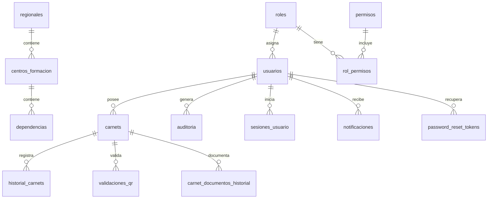

# DATABASE_DOCUMENTATION.md — SENA Carnés v1.0.0

Documentación del modelo de datos MySQL 8.

**Motor:** InnoDB · **Charset:** utf8mb4_unicode_ci · **IDs:** UUID v4 (VARCHAR(36))

Scripts: `database/schema.sql` · `database/seed.sql` · `npm run setup:db`

---

## Diagrama lógico



---

## Tablas principales

### Catálogos organizacionales

| Tabla | Propósito | FK principal |
|-------|-----------|--------------|
| `regionales` | Direcciones regionales SENA | — |
| `centros_formacion` | Centros por regional | `regional_id` |
| `dependencias` | Áreas dentro del centro | `centro_id` |

### Seguridad RBAC

| Tabla | Propósito |
|-------|-----------|
| `roles` | ADMINISTRADOR, COORDINADOR, INSTRUCTOR, APRENDIZ, etc. |
| `permisos` | Códigos granulares (`usuarios.crear`, `carnets.generar`, …) |
| `rol_permisos` | Relación N:M roles ↔ permisos |

### Usuarios

Tabla central del sistema. Campos clave:

| Campo | Tipo | Notas |
|-------|------|-------|
| `email` | VARCHAR(255) UNIQUE | Login |
| `password_hash` | VARCHAR(255) | bcrypt 12 rondas |
| `documento` | VARCHAR(50) UNIQUE | CC, TI, CE, etc. |
| `tipo_usuario` | ENUM | Derivado del rol |
| `estado` | ENUM | ACTIVO, INACTIVO, SUSPENDIDO |
| `foto_url` | VARCHAR(500) | `/uploads/...` |
| `regional_id`, `centro_id`, `dependencia_id` | FK nullable | Alcance organizacional |
| `two_factor_enabled` | TINYINT | 2FA opcional (migración 003) |
| `two_factor_secret` | VARCHAR(255) | Secreto TOTP |

### Carnés

Snapshot inmutable al emitir (nombre, documento, centro quedan congelados).

| Campo | Tipo | Notas |
|-------|------|-------|
| `codigo_unico` | VARCHAR(50) UNIQUE | Formato `{REGIONAL}-{AÑO}-{SEQ}` |
| `qr_token` | VARCHAR(255) UNIQUE | Token firmado HMAC |
| `estado` | ENUM | ACTIVO, VENCIDO, SUSPENDIDO, REVOCADO |
| `fecha_expedicion`, `fecha_vencimiento` | DATE | Vigencia |
| `pdf_url`, `pdf_hash` | VARCHAR | PDF generado (Sprint 5) |
| `template_id` | VARCHAR(50) | Plantilla EJS (`default`) |
| `reimpresiones_count` | INT | Contador reimpresiones |

### Historial y trazabilidad

| Tabla | Propósito |
|-------|-----------|
| `historial_carnets` | Cambios de estado con motivo |
| `carnet_documentos_historial` | GENERAR, DESCARGAR, IMPRIMIR, REIMPRIMIR |
| `validaciones_qr` | Log de escaneos (públicos y autenticados) |
| `auditoria` | Bitácora general del sistema |
| `auditoria_seguridad` | Eventos de seguridad (login fallido, rate limit) |

### Sprint 9 — Sistema

| Tabla | Propósito |
|-------|-----------|
| `configuracion_sistema` | Parámetros clave-valor (institución, sesión, logo, …) |
| `notificaciones` | Alertas internas (usuario específico o global) |
| `sesiones_usuario` | Tracking de sesiones activas |

### Autenticación auxiliar

| Tabla | Propósito |
|-------|-----------|
| `password_reset_tokens` | Tokens de recuperación de contraseña (hash, expiración) |

### Pendiente / parcial

| Tabla | Estado |
|-------|--------|
| `cargas_masivas` | Esquema definido; UI no implementada |

---

## Índices críticos

| Tabla | Índice | Columnas |
|-------|--------|----------|
| `usuarios` | uk_email | email |
| `usuarios` | idx_estado | estado |
| `carnets` | uk_codigo | codigo_unico |
| `carnets` | idx_vencimiento | fecha_vencimiento |
| `auditoria` | idx_fecha | created_at |
| `auditoria` | idx_modulo | modulo |
| `auditoria` | idx_accion | accion |
| `validaciones_qr` | idx_fecha | created_at |
| `sesiones_usuario` | uk_session | session_id |
| `notificaciones` | idx_usuario_leida | usuario_id, leida |

---

## Restricciones de integridad

- **ON DELETE RESTRICT** en FK organizacionales (no eliminar regional con centros)
- **ON DELETE CASCADE** en historial de carnés y sesiones
- **ON DELETE SET NULL** en auditoría (preserva log si se elimina usuario)
- Un usuario solo puede tener **un carné ACTIVO** a la vez (validado en servicio)
- Centro debe pertenecer a la regional del usuario (validado en `users.service.js`)

---

## Flujo de datos

### Emisión de carné

```
Usuario ACTIVO + foto
  → carnets.service.create()
  → INSERT carnets (snapshot)
  → qr.service.generateToken()
  → carnetPdf.service.generate()
  → INSERT historial_carnets
  → INSERT auditoria (CREAR)
```

### Validación QR pública

```
GET /api/validar/:token
  → qr.service.verifyToken()
  → carnets.repository.findByQrToken()
  → INSERT validaciones_qr
  → INSERT auditoria (VALIDAR_QR_*)
  → Respuesta pública sanitizada
```

### Auditoría

Toda mutación crítica pasa por `auditHelper.logAudit()` o `auditoriaService.log()` con:
- usuario, rol, módulo, acción, resultado, IP, user-agent

---

## Migraciones

| Archivo | Sprint | Contenido |
|---------|--------|-----------|
| `database/schema.sql` | 0 | Esquema base |
| `database/seed.sql` | 0 | Datos demo |
| `004_sprint3_roles_activo.sql` | 3 | Campo activo en roles |
| `005_sprint4_carnets_snapshot.sql` | 4 | Campos snapshot |
| `006_sprint5_carnet_pdf.sql` | 5 | PDF + historial documentos |
| `007_sprint6_validacion_qr.sql` | 6 | Ajustes validaciones |
| `002_security_audit.sql` | QG | Tabla auditoria_seguridad |
| `003_password_recovery_2fa.sql` | QG | Reset password + 2FA |
| `008_sprint9_sistema.sql` | 9 | Config, notificaciones, sesiones |

Instalación unificada: `npm run setup:db`

---

## Backup y restauración

Ver [DEPLOYMENT.md](./DEPLOYMENT.md) para procedimientos de producción.

```bash
# Backup
mysqldump -u root -p sena_carnets > backup_$(date +%Y%m%d).sql

# Restaurar
mysql -u root -p sena_carnets < backup_20260701.sql
```

Incluir también el directorio `public/uploads/` (fotos, logos, PDFs).
